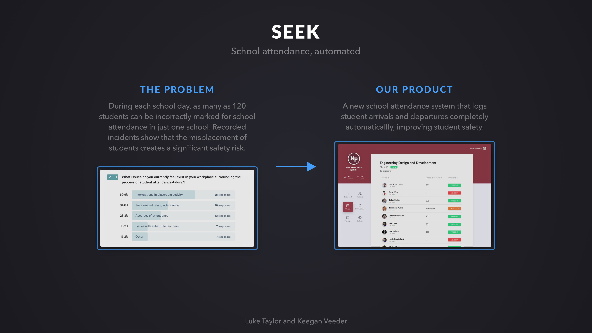
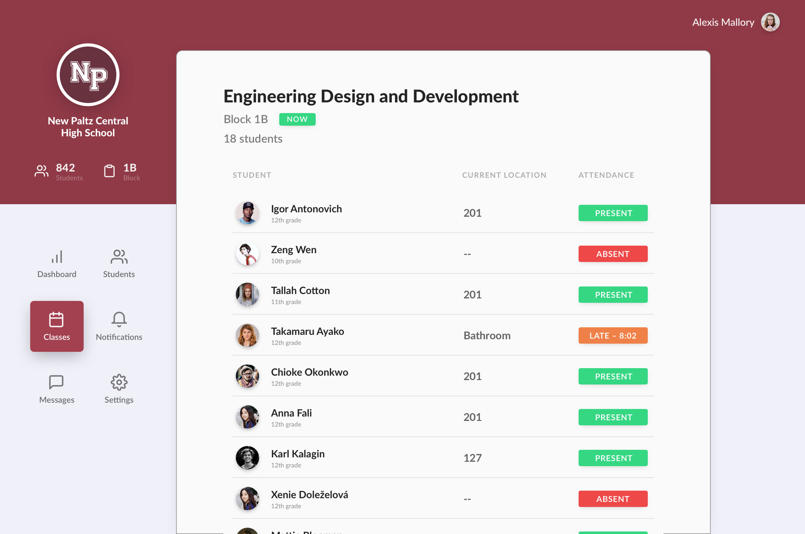

## About
Seek is a system for automated attendance-taking in schools. Seek clients periodically send data about the Wi-Fi signals they observe to [`find3`](https://github.com/schollz/find3), which uses this data to approximate their location within the building. Seek is a proof-of-concept system build on top of `find3` designed to provide meaningful attendance insights to schools and teachers that use the platform.

## Server
The Seek server uses [Prisma](http://prisma.io/) to interact with a MySQL database containing student info, and provides a GraphQL API interface to this data.

## Client
The client is a small proof-of-concept app which consumes the API and presents attendance information to teachers. I designed the client in Sketch and built it with [Vue.js](https://github.com/vuejs/vue).

